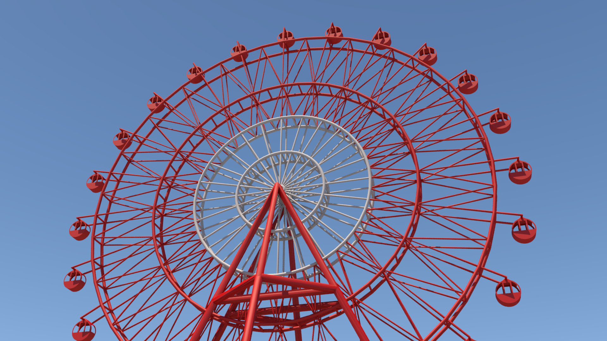
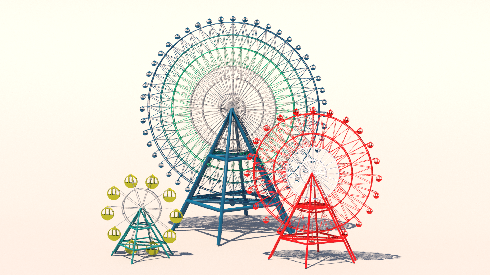
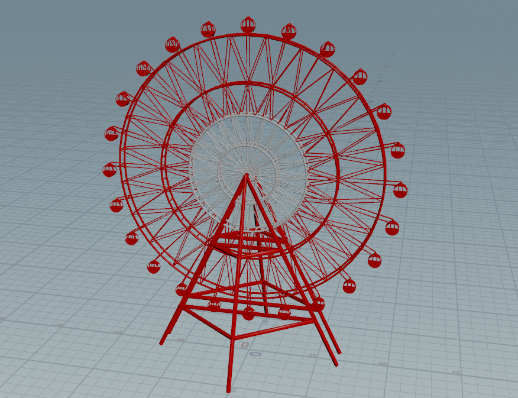

# houdini-ferris-wheel
SOP、VEXを使用して制作した観覧車サンプルです。 
HDAにしているため、様々なバリエーションを簡単に作成することができます。

## Houdiniバージョン
- Houdini Indie 20.5

## HDAファイル一覧

* <a href="hda">hda</a>フォルダ配下に作成した資産を格納しています。 

| ファイル名 | ラベル名 | 概要 |
|----------------|--------------------|--------------------|
| sop_ferris_wheel_generator.hdalc | Ferris Wheel > Ferris Wheel Generator | パラメータから観覧車を生成するHDAです。 下記3つのHDAを内部で使用しています。 |
| sop_gondla_poly.hdalc | Ferris Wheel > Gondla Poly | ゴンドラ部分のポリゴンを生成します。 |
| sop_stand_poly.hdalc | Ferris Wheel > Stand Poly | スタンド部分のポリゴンを生成します。 |
| sop_wheel_edge.hdalc | Ferris Wheel > Wheel Edge | ホイール部分の一つのエリアのエッジを生成します。 |

### Ferris Wheel Generator HDAパラメータ

###### ホイール生成情報リスト（Generate Wheel List）

| 表示名 | パラメータ名 | 概要 |
| - | - | - |
| Radius | radius# | ホイールの半径 |
| Wire Type | wire_type# | 0：Strait：真っ直ぐ繋ぐ 1：Merge Outside：外側のワイヤをマージする 2：Merge Inside：内側のワイヤをマージする |
| Circle Color | circle_color# | 円部分の色 |
| Wire Color | wire_color# | ワイヤ部分の色 |

###### その他

| 表示名 | パラメータ名 | 概要 |
| - | - | - |
| Circle Divisions | circle_divisions | 円部分の分割数 |
| Circle Thickness | circle_thickness | 円部分の厚み |
| Circle Edge Thickness | circle_edge_thickness | 円部分のエッジの太さ |
| Wire Count | wire_count | ワイヤの数 |
| Wire Edge Thickness | wire_edge_thickness | ワイヤのエッジの太さ |
| Gondla Scale | gondla_scale | ゴンドラの大きさ |
| Gondla Color | gondla_color | ゴンドラの色 |
| Stand Edge Thickness | stand_edge_thickness | スタンドのエッジの太さ |
| Stand Distance | stand_distance | スタンド同士の距離 |
| Stand Scale | stand_scale | スタンドの大きさ |
| Stand Color | stand_color | スタンドの色 |
| Rotate Speed | rotate_speed | ホイールを回転させる速度 |

## サンプルシーン

* `ferris_wheel.hiplc`をHoudiniで開いて確認してください。
  * 3種類の観覧車の制作例を用意してあります。

